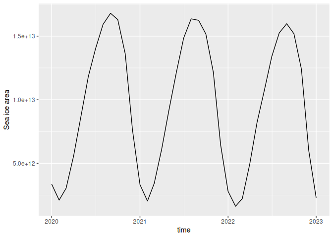

<!-- README.md is generated from README.Rmd. Please edit that file -->

# icecdr

<!-- badges: start -->

[](https://app.codecov.io/gh/eliocamp/icecdr)
[](https://github.com/eliocamp/icecdr/actions/workflows/R-CMD-check.yaml)
<!-- badges: end -->

The goal of icecdr is to download sea ice concentration data from the
NSIDC Climate Data Record.

## Installation

You can install the development version of icecdr from
[GitHub](https://github.com/) with:

``` r
# install.packages("pak")
pak::pak("eliocamp/icecdr")
```

## Example

Use the `cdr_*` functions to download satellite-derived Antarctic or
Arctic sea ice concentration data at monthly or daily resolution. They
use version 5 by default but version 4 is also supported.

The basic usage downloads a NetCDF file in a temporary directory.

``` r
library(icecdr)

dates <- c("2020-01-01", "2023-01-01")
cdr_antarctic_monthly(dates, dir = "data", use_cache = TRUE)
#> [1] "data/995732f34533e77ab2bf32f847c84deb.nc"
```

With `use_cache = TRUE`, files are only downloaded if needed.

``` r
system.time(cdr_antarctic_monthly(dates, dir = "data", use_cache = TRUE))
#>    user  system elapsed 
#>   0.002   0.000   0.002
```

There are four simple functions to download whole-domain data:

``` r
cdr_antarctic_daily()
cdr_antarctic_monthly()

cdr_arctic_daily()
cdr_arctic_monthly()
```

But the `cdr()` function exposes all arguments to download any crazy
subset

``` r
cdr(date_range = dates,
    # Data every 7 days
    date_stride = 7,
    resolution = "daily", 
    # Thin the grid by taking every other gridpoint
    xgrid_stride = 2,
    ygrid_stride = 2, 
    hemisphere = "north"
    )
```

The `cdr_fix_grid()` function will fix the grid information to make it
work with [CDO](https://code.mpimet.mpg.de/projects/cdo). This requires
CDO installed in your system.

``` r
library(rcdo)
library(ggplot2)

cdr_antarctic_monthly(dates, dir = "data", use_cache = TRUE) |> 
  cdr_fix_grid() |> 
  cdo_fldint() |> 
  cdo_execute() |> 
  metR::ReadNetCDF(c(aice = "cdr_seaice_conc_monthly")) |> 
  ggplot(aes(time, aice)) +
  geom_line() +
  labs(y = "Sea ice area")
#> Warning: Using CDO version 2.4.0 which is different from the version supported by this
#> version of rcdo (2.5.1).
#> ℹ This warning is displayed once per session.
```


